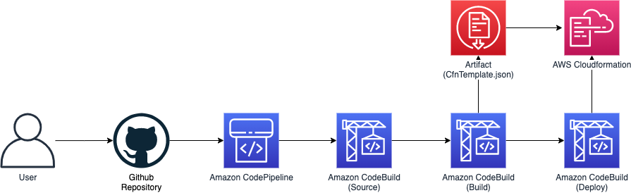

# CDK Deploy Example

This repository is for deploy cdk using AWS CodePipeline



> Running this repository may cost you to provision AWS resources

# Prerequisites

- Nodejs 14.x
- AWS Account and Locally configured AWS credential

# Installation

Install project dependencies

```bash
$ npm i -g cdk@1.93.0

$ cd infra
$ npm i
$ cdk bootstrap
```

# Usage

## Setup Github

TODO: add github token from github web...

copy your token and put it on the AWS Systems Manager Parameter Store.

```bash
aws ssm put-parameter --name github-token --value 0000000000000000000000000000000000000000 --overwrite
```

## Setup Config

Fork this repository,

and open and edit **Pipeline** namespace at [**config.ts**](/infra/lib/interfaces/config.ts)

names on **StackeNames** should be instantiated at [infra.ts](/infra/lib/interfaces/infra.ts)

for example, if you defined and instantiated stacks like below at infra.ts

```javascript
new StorageStack(app, `CdkDeployDemoStorageStack`)
new LambdaStack(app, `CdkDeployDemoLambdaStack`)
```

StackNames variable should goes like this,
```javascript
export namespace Pipeline {
  ...

  export const StackNames = [
    `CdkDeployDemoStorageStack`,
    `CdkDeployDemoLambdaStack`,
  ],
}
```

## Deploy pipeline

Deploy **PipelineStack ONLY**. the pipeline will deploy other instantiated stacks automatically.

```bash
$ cdk deploy CdkDeploymentDemoPipelineStack --require-approval never
```

## Test

uncomment GSI part at [**storage-stack.ts**](/infra/lib/storage-stack.ts) and 
push the modification.

then, the pipeline will be triggered and deploy StorageStack automatically.

# Destroy

You must destroy derivative stacks first,

```bash
$ cdk destroy CdkDeployDemoStroageStack
```

and then destroy pipeline.

```bash
$ cdk destroy CdkDeploymentDemoPipelineStack
```

# TroubleShooting

create role with same name... -- working on this.